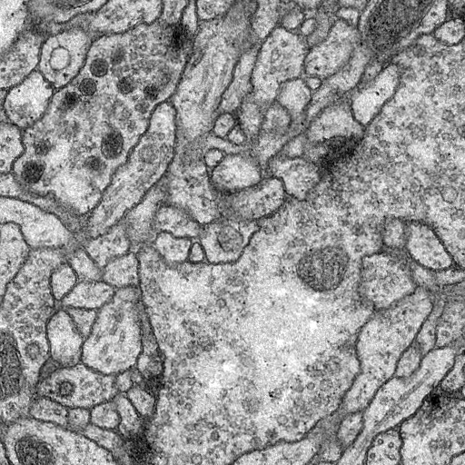
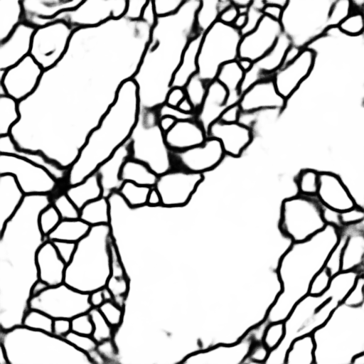
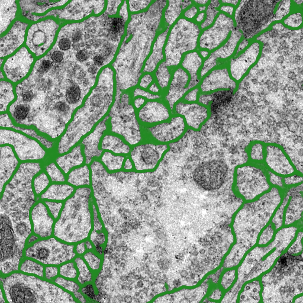

# Bildsegmentierung mittles U-Net

Dieses Repository beinhaltet den Code zur Facharbeit.

Das Experiment wird aus Jupyter-Notebooks heraus gesteuert und die
Dependencies sind im Anaconda-Environment in der Datei conda_env.yaml enthalten
und können so importiert werden.

## Trainieren

Zum Trainieren muss lediglich die Step-Anzahl in training.ipynb angepasst werden.
Das Modell wird dann unter ./experiment/\<step-anzahl>.hdf5 abgespeichert.

## Auswerten

Um ein trainiertes Modell auszuwerten, muss man die Code-Zellen von
experiment.ipynb ausführen. Die letzte ist optional und nicht notwendig
für die Auswertung, da sie nur die Overlays erstellt.

## Dependencies

Die hauptsächlich verwendeten Bibliotheken sind:
- Keras (wrapper für TensorFlow und andere Bibliotheken)
- numpy
- matplotlib
- scikit-image

## Beispiele

Nachfolgend ein originales Bild mit seiner vorhergesagten Maske sowie 
ein Kompositbild, in dem die Maske über die Mikroskopierung gelegt wurde.

### Danksagung

Einige Code-Snippets wurden inspiriert vom folgenden Repository: 
[zhixuhao/unet](https://github.com/zhixuhao/unet)